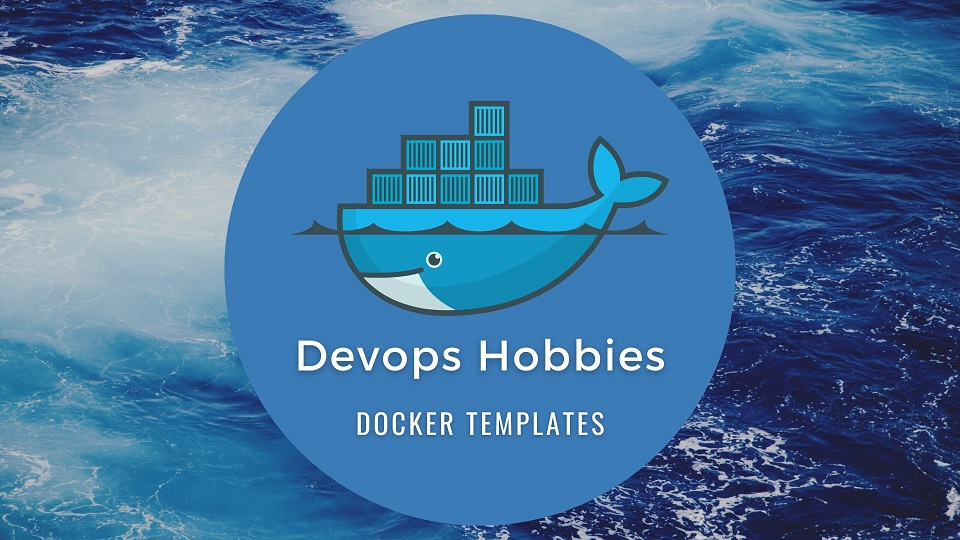

# docker-templates

## What's the goal?!

In this repository, we are trying to create some practical samples for each language,
so you can use them in your personal projects.
Please do not hesitate to contribute.

Let's grow together!

DVH

## languages 

You can find different frameworks or use cases in each folder.

<!-- [number-language-framework or environment](link to repo) -->

[01-JavaScript/Typescript-Backend](01-JavaScript-Typescript-Backend/)

[02-JavaScript/Typescript-Frontend](02-JavaScript-Typescript-Frontend/)

[03-PHP](03-PHP/)

[04-Go](04-GO/)

[05-Java](05-JAVA/)

[06-C#](06-C%23/)

[07-Python](07-Python/)

