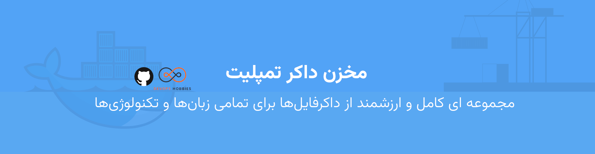

# Docker-Templates

This repository is a good source of docker templates added and modified by users as a best practice. You can navigate, check and use them as you wish. This repository was created for educational purposes and remains free forever.
Let's grow together - DevOps Hobbies team.

## The goal.

In this repository, we are trying to gather some practical samples of the `docker` file templates for each language and technology, so you can use them in your projects.
We are trying to provide docker files and templates as best practices.

## How to contribute?

We are performing a helpful guide about how you can contribute to the project and You can access it [from here](./CONTRIBUTING.md).
If you find a problem anywhere in the project even in the `CONTRIBUTING.md` file, You can change the file but make sure You understand what are You doing, and if You need any other help, just create an issue and we'll be there to give you one.

## languages

You can find different frameworks or use cases in each folder.

<!-- [number-language-framework or environment](Link to readme or folder) -->

### Javascript, Typescript `Backend` & related frameworks

- Plain NodeJS: [Dockerfile](01-JavaScript-Typescript-Backend/Dockerfile), [Readme](./01-JavaScript-Typescript-Backend/README.md/)
- NestJS: [Dockerfile](01-JavaScript-Typescript-Backend/frameworks/nestjs/Dockerfile), [Readme](./01-JavaScript-Typescript-Backend/frameworks/nestjs/README.md)

### Javascript, Typescript `Frontend` & related frameworks

- Plain Javascript: [Readme](./02-JavaScript-Typescript-Frontend/README.md)
- Angular: [Dockerfile](./10-Angular/angular/Dockerfile), [Docker Compose](./10-Angular/compose.yaml), [Readme](./10-Angular/README.md)
- Vue.JS: [Dockerfile](./11-Vue.js/Dockerfile), [Readme](./11-Vue.js/README.md)
- React: [Dockerfile](./12-React/Dockerfile), [Readme](./12-React/README.md)

### PHP programming language & related frameworks

- Plain PHP: [Readme](./03-PHP/./README.md)
- Laravel: [Dockerfile](./03-PHP/laravel/Dockerfile), [Readme](./03-PHP/laravel/README.md)

### Go programming language & related frameworks

- Plain Go: [Dockerfile](./04-GO/Dockerfile), [Readme](./04-GO/README.md)

### Java programming language & related frameworks

- Plain Java: [Readme](./05-JAVA/README.md)
- Maven: [Dockerfile](./05-JAVA/Maven/README.md), [Readme](./05-JAVA/Maven/README.md)

### C# programming language & related frameworks

- Plain C# (hello docker example): [Dockerfile](./06-C%23/HelloDocker/Dockerfile), [Readme](./06-C%23/HelloDocker/README.md)

### Python programming language & related frameworks

- Python Flask (hello world app): [Dockerfile](./07-Python/python-flask/Dockerfile), [Readme](./07-Python/python-flask/README.md)
- Plain Python with postgres: [Dockerfile](./07-Python/python-with-postgresql/Dockerfile), [Dockerfile Compose](./07-Python/python-with-postgresql/docker-compose.yaml), [Readme](./07-Python/README.md)
- Django: [Dockerfile](./07-Python/python-django/Django), readme required

### C++ programming language & related frameworks

- Plain C++ (hello world example): [Dockerfile](./08-C%2B%2B/Dockerfile), [Readme](./08-C%2B%2B/README.md)

### Ruby programming language & related frameworks

- Plain Ruby (hello world example): [Dockerfile](./09-RUBY/Dockerfile), [Readme](./README.md)

### Dart programming language & related frameworks

- Plain Dart (hello world example): [Dockerfile](./14-Dart/Dockerfile), [Readme](./14-Dart/README.md)

### Rust programming language & related frameworks

- Plain Rust: [Dockerfile](./15-Rust/Dockerfile), [Readme](./15-Rust/README.md)
